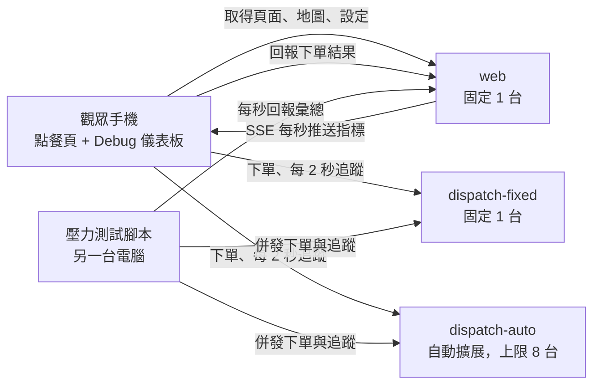

# 外送系統：以外送派單系統展示 Cloud Run Auto Scaling

本專案，以「外送平台尖峰時段派單」為情境，比較**固定容量部署**與**自動擴展部署**在流量暴增時的差異。

實作進度與開發順序請見 [docs/規劃書.md](docs/規劃書.md)。

**目錄**

1. [設計理念](#1-設計理念)
2. [展示情境](#2-展示情境)
3. [系統架構](#3-系統架構)
4. [派單與追蹤演算法](#4-派單與追蹤演算法)：[城市路網](#41-城市路網) · [派單流程](#42-單筆訂單派單流程) · [配送追蹤](#43-配送追蹤)
5. [API](#5-api)
6. [Debug 儀表板指標](#6-debug-儀表板指標)
7. [壓力測試工具](#7-壓力測試工具)
8. [部署](#8-部署)
9. [目錄結構](#9-目錄結構)
10. [本機測試](#10-本機測試)：[啟動](#101-啟動) · [使用方式](#102-使用方式) · [疑難排解](#103-疑難排解) · [開發與手動啟動](#104-開發與手動啟動)
11. [已知限制](#11-已知限制)

## 1. 設計理念

外送平台的流量高度集中於用餐尖峰。尖峰的困難不在於單筆訂單變得複雜，而在於訂單量在短時間內暴增。後端要處理兩種運算，兩者都隨訂單量成長：

- **派單**：每筆訂單一次，運算較重（篩選外送員、規劃路線、估算送達時間）。
- **配送追蹤**：派單後到送達前持續進行，每次運算較輕（依外送員目前位置與即時路況重新規劃路線、更新預估送達時間）。進行中的配送越多，追蹤負載越大。

本系統讓每筆訂單執行一段合理的派單演算法，並在配送期間持續追蹤，再以外部壓力測試模擬尖峰訂單量，觀察：

- **固定容量**（預先配置一台伺服器）：運算能力固定，尖峰時請求排隊，最終逾時失敗。
- **自動擴展**（Cloud Run Auto Scaling）：依負載自動增加執行個體，尖峰時仍能即時回應；配送結束、負載下降後再縮減。

兩者使用**同一份映像檔、相同的 CPU、記憶體與並行設定**，唯一差異是可否擴展，以確保對照公平。

## 2. 展示情境

1. 觀眾以手機掃描 QR code 開啟點餐頁，以訪客身分下單。同一筆訂單會同時送往固定容量版與自動擴展版。
2. **一般時段**：未啟動壓力測試，兩個版本皆在一秒內完成派單。追蹤頁上下兩個區塊各自顯示地圖、外送員即時位置、預估外送時間與進度，位置由各自的後端持續更新。
3. **尖峰時段**：在另一台電腦啟動壓力測試腳本後，觀眾再次下單。自動擴展版正常派單並持續更新位置；固定容量版的派單持續等待，最終顯示逾時或服務忙碌，進行中配送的位置更新也會延遲。
4. 點餐頁的 Debug 儀表板即時顯示兩個版本的執行個體數、吞吐量、成功率與延遲。GCP 主控台的 Cloud Run 指標作為官方佐證。

壓力測試流量全部來自同一個來源 IP。系統**刻意不實作**速率限制、IP 封鎖或驗證，以模擬尖峰流量全數進入後端的情況。

## 3. 系統架構



| 元件 | 部署 | 擴展設定 | 職責 |
|---|---|---|---|
| `dispatch-fixed` | Cloud Run | max 1 | 派單與配送追蹤運算（對照組） |
| `dispatch-auto` | Cloud Run | max 8 | 派單與配送追蹤運算（實驗組） |
| `web` | Cloud Run | max 1 | 提供點餐頁、地圖與設定；收集回報；以 SSE 推送 Debug 指標 |
| 前端 | 觀眾手機瀏覽器 | — | 點餐、追蹤配送、Debug 儀表板 |
| `loadtest` | 另一台電腦 | — | 模擬大量顧客：以固定到達速率下單，並追蹤各自的配送直到送達；每秒回報 web |

設計要點：

- 頁面與地圖由 `web` 提供，不經過 dispatch，壓力測試期間頁面仍可正常開啟。
- 手機直接呼叫兩個 dispatch 服務，量測到的延遲即為各服務的真實延遲。
- **dispatch 完全無狀態**：配送狀態由用戶端保管，每次追蹤請求都附上最新的追蹤狀態（見 4.3），任何一台執行個體都能處理，因此擴展版可以自由增減執行個體，不需要資料庫或工作階段黏著。
- 系統不使用資料庫。`web` 的指標僅保存於記憶體，因此必須維持單一執行個體。
- 壓力測試與觀眾的行為相同（下單後追蹤到送達），只是同時模擬大量顧客；它直接呼叫 dispatch，不經過 `web`。

## 4. 派單與追蹤演算法

### 4.1 城市路網

以固定種子產生的虛擬城市，所有服務產生的結果完全一致：

- `CITY_GRID_SIZE × CITY_GRID_SIZE` 格狀路網，路口之間以上下左右相連。
- 隨機封閉約 10% 路段，且保證路網維持連通。
- 數條低權重主幹道（一般道路每段 30 秒，主幹道每段 15 秒）。
- 一條河流橫越城市，沿著兩列路口之間蜿蜒：跨河與被河道斜穿的路段一律封閉，只有主幹道是橋，外送員必須繞到主幹道過河。封閉的路段計入約 10% 的封閉比例。
- 6 家店家，每家 4 至 6 項餐點，各有價格與備餐時間。
- 顧客地址為選填。填寫時以地址字串的雜湊對應至固定路口；未填寫時隨機選取路口。

### 4.2 單筆訂單派單流程

1. **路況權重**：依「目前分鐘數 + 路段」計算壅塞係數（1.0 至 2.0），路況隨時間變化，故結果不可快取。
2. **外送員產生**：在離店家 `RIDER_MIN_RADIUS` 到 `RIDER_RADIUS` 之間（曼哈頓距離）隨機產生 `RIDERS` 位外送員。
3. **候選篩選**：自店家執行一次完整 Dijkstra，取路網距離最近的 `CANDIDATES` 位。
4. **替代路線**：以懲罰法求出每位候選人「外送員→店家」及「店家→顧客」各 `ALT_ROUTES` 條路線：每找到一條路線，即將其路段權重乘以 `ALT_PENALTY` 後重新搜尋。
5. **評分**：`分數 = 最佳 ETA + RELIABILITY_WEIGHT × (最差替代路線 ETA − 最佳 ETA)`，替代路線 ETA 以未懲罰的權重計算。取分數最低者。
6. **行程**：外送員抵達店家 → 等待備餐（取訂單中最長的備餐時間）→ 出發 → 送達。

每筆訂單約執行 `1 + (CANDIDATES + 1) × ALT_ROUTES` 次最短路徑搜尋，目標為單筆在 1 vCPU 上約 100 毫秒。

外送員位置為每筆訂單獨立隨機產生，不追蹤外送員的忙碌狀態（見第 11 節）。

### 4.3 配送追蹤

派單後，外送員在**模擬時間**中移動：模擬時間 = 真實經過秒數 × `TIME_SCALE`（預設 20，25 分鐘的配送約 75 秒播完）。模擬時間以 dispatch 的伺服器時鐘計算，與用戶端時鐘無關。

**追蹤狀態**（`tracking`）由用戶端保管：派單回應附上初始狀態，之後每次呼叫 `POST /api/track` 都送上最新狀態，並以回應中的新狀態取代。狀態內容包含派單時刻、上次推進到的模擬時間、配送階段、外送員所在路段與路段完成比例、店家與顧客路口、取餐時間。

每次追蹤請求的運算：

1. 依**模擬時刻**（派單時刻 + 模擬經過秒數）的分鐘數計算路況權重，計算方式與派單相同；因此模擬的配送過程中路況會隨時間變化。單次請求內使用同一份權重。
2. **重新規劃**：若外送員正在路段中途，先走完該路段；再從下一個路口以點對點 Dijkstra 規劃到目前目的地（店家或顧客）的最佳路線。路況改變時，外送員會改走新的最佳路線。
3. **推進**：依目前路況下各路段的通行時間，把外送員從上次的模擬時間推進到現在。抵達店家後等待至取餐時間，取餐後目的地改為顧客，抵達顧客即為送達。
4. **預估送達**：剩餘路線的通行時間（目的地為店家時，加上等待備餐與店家到顧客的路線）。

每次追蹤約執行 1 至 2 次點對點最短路徑搜尋，本機量測約 10 毫秒（派單約 55 毫秒）。以預設的 `TIME_SCALE` 與 2 秒追蹤間隔，一筆配送約追蹤 40 次，因此追蹤的總運算量約為派單的 7 倍；`TIME_SCALE` 越大，配送越快結束、追蹤次數越少。

## 5. API

### 5.1 dispatch（`dispatch-fixed` 與 `dispatch-auto` 相同）

`POST /api/orders`

```json
{
  "order_id": "uuid",
  "restaurant_id": "r1",
  "items": [{ "item_id": "r1-m2", "qty": 1 }],
  "customer": { "name": "", "phone": "", "address": "", "note": "" },
  "seed": null
}
```

`customer` 內所有欄位皆為選填。亂數種子決定外送員分布與未填地址時的顧客位置：未帶 `seed` 時以 `order_id` 為種子，因此同一筆訂單送往兩個版本會得到相同的派單結果，不同訂單之間仍為隨機；`seed` 僅供測試與校準使用，帶相同 `seed` 時結果固定，不受 `order_id` 影響。

回應 `200`：

```json
{
  "order_id": "uuid",
  "service": "dispatch-auto",
  "instance_id": "00bf4bf0...",
  "compute_ms": 103.4,
  "restaurant": { "id": "r1", "name": "...", "node": [12, 40] },
  "customer_node": [33, 8],
  "total_price": 180,
  "rider": { "id": "rd-17", "name": "..." },
  "route": {
    "to_restaurant": [[5, 40], [6, 40]],
    "to_customer": [[12, 40], [12, 39]]
  },
  "schedule": { "arrive_restaurant_s": 420, "pickup_s": 600, "deliver_s": 1380 },
  "eta_minutes": 23,
  "candidates_evaluated": 5,
  "tracking": { "...": "初始追蹤狀態，用戶端原封不動送回" }
}
```

回應 `422`：店家或品項不存在、數量不合法。

`POST /api/track`

```json
{ "order_id": "uuid", "tracking": { "...": "上一次回應中的 tracking" } }
```

回應 `200`：

```json
{
  "order_id": "uuid",
  "service": "dispatch-auto",
  "instance_id": "00bf4bf0...",
  "compute_ms": 6.2,
  "phase": "to_customer",
  "position": [14.4, 38],
  "trail": [[12, 40], [13, 40], [14, 40], [14, 39], [14.4, 38]],
  "route": [[14.4, 38], [15, 38], [15, 37]],
  "eta_s": 812,
  "sim_s": 568,
  "tracking": { "...": "新的追蹤狀態" }
}
```

| 欄位 | 說明 |
|---|---|
| `phase` | `to_restaurant`、`waiting`、`to_customer`、`delivered` |
| `position` | 外送員目前位置，路段中途時為小數座標 |
| `trail` | 本次推進經過的路徑，前端沿此路徑平滑移動 |
| `route` | 從目前位置到目前目的地的最新路線 |
| `eta_s` | 距離送達的模擬秒數，送達後為 0 |
| `sim_s` | 派單後經過的模擬秒數 |

回應 `422`：追蹤狀態格式不合法。

`GET /api/healthz`：回傳 `{"ok": true}`，不執行運算。

### 5.2 web

| 方法與路徑 | 說明 |
|---|---|
| `GET /` | 點餐頁 |
| `GET /api/config` | `{ "fixed_url", "auto_url", "timeout_ms", "track_interval_ms" }` |
| `GET /api/map` | 路網尺寸、封閉路段、主幹道、河流、店家與菜單 |
| `POST /api/reports/order` | 手機回報單筆訂單於兩個版本的派單結果 |
| `POST /api/reports/track` | 手機回報單次追蹤請求的結果 |
| `POST /api/reports/loadtest` | 壓力測試每秒回報彙總 |
| `GET /api/stream` | SSE，每秒推送一次 `snapshot` 事件 |

`POST /api/reports/order`：

```json
{
  "order_id": "uuid",
  "results": [
    { "target": "fixed", "outcome": "timeout", "latency_ms": 10000, "instance_id": null },
    { "target": "auto", "outcome": "ok", "latency_ms": 412, "instance_id": "00bf4bf0..." }
  ]
}
```

`POST /api/reports/track`（每次追蹤請求結束後回報一次，成功或失敗皆回報）：

```json
{ "target": "auto", "outcome": "ok", "latency_ms": 18, "instance_id": "00bf4bf0..." }
```

`POST /api/reports/loadtest`（下單與追蹤請求合併計數）：

```json
{
  "targets": {
    "fixed": {
      "ok": 8, "timeout": 52, "busy": 0, "error": 0,
      "latency_samples_ms": [10000, 9873],
      "instance_ids": ["00a1..."]
    },
    "auto": { "ok": 60, "timeout": 0, "busy": 0, "error": 0, "latency_samples_ms": [388], "instance_ids": ["00bf...", "00c2..."] }
  }
}
```

`outcome` 定義（手機與壓力測試一致，下單與追蹤皆適用）：

| 值 | 條件 |
|---|---|
| `ok` | 10 秒內收到 HTTP 200 |
| `timeout` | 超過 10 秒未完成，`latency_ms` 記為 10000 |
| `busy` | HTTP 429 |
| `error` | 其他 HTTP 狀態碼或網路錯誤 |

`snapshot` 事件：

```json
{
  "now": 1760000000,
  "targets": {
    "fixed": {
      "instances": 1, "rps": 9.8, "success_rate": 0.13,
      "p50_ms": 10000, "p95_ms": 10000,
      "failures": { "timeout": 3100, "busy": 0, "error": 0 }
    },
    "auto": { "instances": 7, "rps": 60.2, "success_rate": 1.0, "p50_ms": 380, "p95_ms": 920, "failures": { "timeout": 0, "busy": 0, "error": 0 } }
  },
  "students": { "orders": 32, "fixed_ok": 12, "auto_ok": 32 },
  "series": [
    { "t": 1759999410, "fixed": { "success_rate": 1.0, "p95_ms": 210 }, "auto": { "success_rate": 1.0, "p95_ms": 205 } }
  ]
}
```

## 6. Debug 儀表板指標

點餐頁右上角的 Debug 按鈕展開儀表板，並開始接收 SSE。手機上兩個版本上下排列，寬螢幕上左右並列。

| 指標 | 計算方式 |
|---|---|
| 活躍執行個體數 | 最近 10 秒內曾處理請求的不同 `instance_id` 數量 |
| RPS | 最近 60 秒完成的請求數 ÷ 60（觀眾與壓力測試的下單、追蹤合計） |
| 每秒成功率 | 最近一個已結束、有完成請求的那一秒（往回最多 10 秒）`ok` ÷ 完成數；60 秒視窗會讓服務掛掉後仍被先前的成功撐住 |
| p50 / p95 延遲 | 最近 60 秒延遲樣本的分位數，逾時以 10000 毫秒計 |
| 失敗分類 | 最近 60 秒 `timeout`、`busy`、`error` 各自計數 |
| 觀眾訂單 | 最近 60 秒觀眾下單數，以及兩個版本各自成功數 |
| 趨勢圖 | 最近 10 分鐘，每 10 秒一點，繪製成功率與 p95 延遲 |

`instance_id` 由各執行個體啟動時向 Cloud Run metadata server 取得。閒置中的執行個體不計入活躍數，總數以 GCP 主控台為準。觀眾手機的追蹤結果也逐筆回報 web，因此只有觀眾下單、未開壓力測試時，配送進行中的執行個體仍計入活躍數；追蹤不計入「觀眾訂單」。

## 7. 壓力測試工具

Windows 可直接雙擊 `run_loadtest.bat`，或不帶參數執行 `python -m loadtest` 進入互動模式：依序選擇目標環境（本機或雲端）、模式（壓測或量測容量）與速率，確認後開始。本機的 web 固定為 `http://localhost:8000`；雲端第一次使用時貼上 web 網址，會記在專案根目錄的 `.loadtest.json`（不進 git），之後直接沿用。

非互動模式（固定版與擴展版的網址預設取自 web 的 `/api/config`，也可用 `--fixed`、`--auto`、`--target` 指定）：

```bash
python -m loadtest run --report-to <WEB_URL> --rate 60 --ramp 60 --duration 300
python -m loadtest probe --report-to <WEB_URL>
```

互動模式的預設速率：本機每秒 8 位新顧客、加壓 20 秒、持續 120 秒（本機固定版只有 1 個程序，擴展版以 8 個 worker 模擬擴展到上限，此速率會讓固定版過載而擴展版撐得住）；雲端沿用上方預設，P8 校準後更新。

- **模擬顧客**：每位模擬顧客下單成功後，每隔 `track_interval_ms`（取自 web 的 `/api/config`）追蹤一次，直到送達；與觀眾手機的行為相同。
- **開放式負載**：新顧客依固定到達速率出現，不等待先前顧客完成，模擬顧客持續下單。封閉式負載會因目標變慢而自動降速，掩蓋固定容量版的瓶頸，故不採用。同一位顧客的追蹤請求一次只有一個，回應後才排定下一次。
- 兩個目標以相同速率、相同訂單內容同時施壓。
- `--ramp` 秒內由 0 線性加壓至 `--rate`。
- **多程序**：`run` 預設把到達速率平均分給 `--procs` 個程序（預設為 CPU 核心數的一半，最多 4），各自施壓並回報 web，終端機只印合併後的每秒統計。單一程序在每秒上百個請求時會跑滿一個核心，回應要排隊等事件迴圈處理，量到的延遲會包含壓測工具自己的排隊時間。`probe` 速率低，維持單一程序。
- 每個目標同時進行中的請求（下單與追蹤合計）上限為 2000（多程序時平均分配），超出部分記為 `dropped`，僅顯示於終端機，不回報為伺服器失敗。
- `--duration` 結束後不再產生新顧客，進行中的配送繼續追蹤到送達（或 Ctrl+C 中止）。
- `--report-to` 為必填，每秒回報 `web` 一次；每秒延遲樣本最多 200 筆。
- `probe` 以固定 `seed` 逐步提高新顧客的到達速率（含後續追蹤），直到失敗率超過 5%，輸出單一執行個體每秒可服務的訂單數。

## 8. 部署

所有服務使用同一份容器映像檔，以環境變數 `APP`（`dispatch` 或 `web`）決定啟動的應用程式。部署區域為 `asia-east1`。

| 服務 | CPU / 記憶體 | concurrency | timeout | max-instances |
|---|---|---|---|---|
| `dispatch-fixed` | 1 / 512Mi | 4 | 30s | 1 |
| `dispatch-auto` | 1 / 512Mi | 4 | 30s | 8 |
| `web` | 1 / 512Mi | 250 | 3600s | 1 |

三個服務的 min-instances 平時為 0，展示前調整為 1，以避免冷啟動。

```bash
./deploy.sh deploy   # 建置映像檔並部署三個服務
./deploy.sh warm     # min-instances 設為 1（展示前）
./deploy.sh cool     # min-instances 設為 0（平時）
```

主要環境變數：

| 變數 | 服務 | 預設 | 說明 |
|---|---|---|---|
| `APP` | 全部 | — | `dispatch` 或 `web` |
| `CITY_GRID_SIZE` | 全部 | 60 | 路網邊長，三個服務必須一致 |
| `RIDERS` / `RIDER_MIN_RADIUS` / `RIDER_RADIUS` | dispatch | 30 / 8 / 15 | 外送員數量與分布的最近、最遠距離 |
| `CANDIDATES` | dispatch | 5 | 候選外送員數 |
| `ALT_ROUTES` / `ALT_PENALTY` | dispatch | 3 / 1.5 | 替代路線數與懲罰倍率 |
| `RELIABILITY_WEIGHT` | dispatch | 0.5 | 評分中路線穩定度的權重 |
| `TIME_SCALE` | dispatch | 20 | 模擬時間倍率（模擬秒數 ÷ 真實秒數） |
| `ALLOWED_ORIGIN` | dispatch | — | `web` 的網址（CORS），多個以逗號分隔 |
| `FIXED_URL` / `AUTO_URL` | web | — | 兩個 dispatch 服務的網址 |
| `TIMEOUT_MS` | web | 10000 | 前端逾時 |
| `TRACK_INTERVAL_MS` | web | 2000 | 手機與壓力測試的追蹤間隔 |

## 9. 目錄結構

```
shared/      城市路網、店家與菜單（dispatch 與 web 共用）
dispatch/    派單、配送追蹤演算法與 API
web/         回報、指標彙整、SSE；static/ 為前端
loadtest/    壓力測試 CLI
tests/       pytest
deploy.sh    部署腳本
Dockerfile   共用映像檔
run_local.bat     Windows 本機一鍵啟動三個服務（自動建立虛擬環境）
run_loadtest.bat  Windows 互動式壓力測試
```

## 10. 本機測試

不需要 GCP 帳號與 Docker，在一台 Windows 電腦上就能跑完整的展示：固定版以 1 個程序代表「固定 1 台」，擴展版以 8 個 worker 代表「已擴展到上限 8 台」。本機無法展示「從 1 台逐步擴展」的過程，那部分要部署到 Cloud Run 才看得到。

### 10.1 啟動

需求：Windows、Python 3.10 以上（安裝時勾選加入 PATH，或使用 `py` 啟動器）。

1. 雙擊專案根目錄的 `run_local.bat`。
2. 第一次執行會自動建立 `.venv` 並安裝 `requirements.txt`，約需一兩分鐘；之後只有 `requirements.txt` 變動時才會重新安裝。
3. 接著開啟三個視窗，約 4 秒後瀏覽器自動開啟 <http://localhost:8000>：

| 視窗 | 網址 | 角色 |
|---|---|---|
| `dispatch-fixed :8001` | <http://localhost:8001> | 固定容量版（1 個程序） |
| `dispatch-auto :8002` | <http://localhost:8002> | 自動擴展版（8 個 worker） |
| `web :8000` | <http://localhost:8000> | 點餐頁、Debug 儀表板 |

停止：關閉三個視窗，或在各視窗按 Ctrl+C。

修改程式後必須關閉三個視窗、重新執行 `run_local.bat` 才會套用；只改 `web/static/` 的前端檔案時，在瀏覽器按 Ctrl+Shift+R 強制重新整理即可。

服務只監聽 `localhost`，同一個區網的手機無法連入；要用手機展示請部署到 Cloud Run（第 8 節）。

### 10.2 使用方式

**一般時段（不開壓測）**

1. 在點餐頁選一家餐廳，加入餐點後按「查看購物車」。
2. 結帳頁的資料全部選填；地址留空時系統會隨機指定位置。按「下訂單」。
3. 追蹤頁左右兩欄分別是固定容量版與自動擴展版，各自顯示地圖、外送員位置、預估外送時間與進度。此時兩邊都應在一秒內完成派單。
4. 按右上角的「Debug」展開儀表板，可看到兩個版本的個體數、RPS、每秒成功率、p50 / p95 延遲與失敗分類（第 6 節）；「趨勢圖」可展開最近 10 分鐘的變化。

**尖峰時段（開壓測）**

1. 保持三個服務執行中，雙擊 `run_loadtest.bat`（需先執行過 `run_local.bat` 建好 `.venv`）。
2. 目標環境選 `1`（本機），模式選 `1`（壓測），速率直接按 Enter 使用預設值（每秒 8 位新顧客、加壓 20 秒、持續 120 秒），確認後開始。終端機每秒印出兩個版本的請求、成功、失敗與 p95。
3. 壓測進行中回到點餐頁再下一單，並打開 Debug 儀表板觀察：

| | 固定容量版 | 自動擴展版 |
|---|---|---|
| 個體數 | 1 | 最多 8（每個 worker 是一個 `instance_id`） |
| 每秒成功率 | 逐漸下降，派單與追蹤開始逾時 | 維持接近 100% |
| p95 延遲 | 升到 10 秒（逾時上限） | 遠低於固定版 |
| 追蹤頁 | 持續等待，最後顯示「逾時：超過 10 秒沒有回應」，或「位置更新延遲」 | 正常派單，外送員持續移動 |

4. 壓測持續時間結束後不再產生新顧客，終端機會等進行中的配送送達後印出總計；要提前結束按 Ctrl+C（再按一次強制結束）。

想更快看到固定版過載，可以把每秒新顧客數調高；若連擴展版也出現大量逾時，代表已超過這台電腦的運算能力，請調低。

### 10.3 疑難排解

| 狀況 | 原因與處理 |
|---|---|
| `run_local.bat` 顯示找不到 Python 3.10 | 安裝 Python 3.10 以上並加入 PATH，或安裝 `py` 啟動器後重試 |
| `Setup failed` | 依上方的錯誤訊息處理（常見為網路無法下載套件）；修正後重新執行即可 |
| 視窗一開就關閉或顯示 port 被占用 | 前一次的服務還在執行，關閉舊視窗後再啟動 |
| 追蹤頁顯示「錯誤：無法連線」 | 對應的 dispatch 視窗已關閉或當機，重新執行 `run_local.bat` |
| 改了程式但畫面或行為沒變 | 前端按 Ctrl+Shift+R；後端要重開三個服務 |

### 10.4 開發與手動啟動

本機直接以 uvicorn 啟動，不需要 Docker；`APP` 只供容器判斷要啟動哪個服務。容器映像檔使用 Python 3.12，本機程式碼需維持與 3.10 相容。

```bash
python -m venv .venv
.venv/Scripts/pip install -r requirements.txt    # macOS / Linux：.venv/bin/pip
.venv/Scripts/python -m pytest
```

bash（只啟動一個 dispatch，固定版與擴展版共用）：

```bash
ALLOWED_ORIGIN=http://localhost:8000,http://127.0.0.1:8000 .venv/Scripts/python -m uvicorn dispatch.main:app --port 8001
FIXED_URL=http://localhost:8001 AUTO_URL=http://localhost:8001 .venv/Scripts/python -m uvicorn web.main:app --port 8000
```

Windows cmd 手動啟動（兩個視窗各執行一組）：

```cmd
set ALLOWED_ORIGIN=http://localhost:8000,http://127.0.0.1:8000
.venv\Scripts\python -m uvicorn dispatch.main:app --port 8001

set FIXED_URL=http://localhost:8001
set AUTO_URL=http://localhost:8001
.venv\Scripts\python -m uvicorn web.main:app --port 8000
```

PowerShell：

```powershell
$env:ALLOWED_ORIGIN = "http://localhost:8000,http://127.0.0.1:8000"
.venv\Scripts\python -m uvicorn dispatch.main:app --port 8001

$env:FIXED_URL = "http://localhost:8001"; $env:AUTO_URL = "http://localhost:8001"
.venv\Scripts\python -m uvicorn web.main:app --port 8000
```

Windows 上單一程序的 uvicorn 請加上 `--loop asyncio:SelectorEventLoop`（`run_local.bat` 已加上）：預設的 ProactorEventLoop 在 Python 3.10 遇到一次連線接受失敗就會關閉監聽，壓測後服務仍在執行卻不再接受連線。

## 11. 已知限制

- 外送員位置為每筆訂單獨立產生，不追蹤忙碌狀態，同一位外送員可能被重複指派。
- 外送員為模擬移動，沒有真實 GPS；位置由 dispatch 依模擬時間與路況推進。
- 追蹤狀態由用戶端保管並在每次請求送回，未簽章，可被竄改。真實系統通常把配送狀態存在伺服器端的共用儲存（如 Redis）；本系統為了不使用資料庫並讓 dispatch 可自由擴展而採用此設計。
- `web` 為單一執行個體，指標僅存於記憶體，重新啟動即清空。
- 回報 API 未驗證來源，可被偽造。
- 為展示需要，系統未實作任何速率限制或來源 IP 阻擋。
