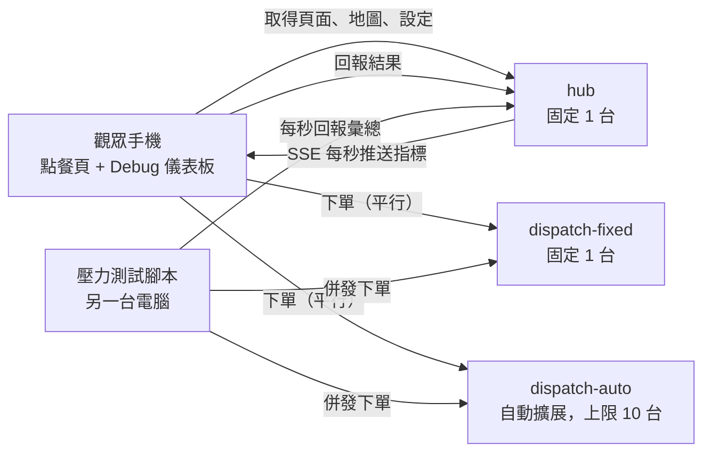

# 外送快閃：以外送派單系統展示 Cloud Run Auto Scaling

本專案，以「外送平台尖峰時段派單」為情境，比較**固定容量部署**與**自動擴展部署**在流量暴增時的差異。

實作進度與開發順序請見 [docs/規劃書.md](docs/規劃書.md)。

## 1. 設計理念

外送平台的流量高度集中於用餐尖峰。尖峰的困難不在於單筆訂單變得複雜，而在於訂單量在短時間內暴增：每筆訂單都需要即時完成派單運算（篩選外送員、規劃路線、估算送達時間），運算量隨訂單量線性成長。

本系統讓每筆訂單執行一段合理的派單演算法，再以外部壓力測試模擬尖峰訂單量，觀察：

- **固定容量**（預先配置一台伺服器）：運算能力固定，尖峰時請求排隊，最終逾時失敗。
- **自動擴展**（Cloud Run Auto Scaling）：依負載自動增加執行個體，尖峰時仍能即時回應。

兩者使用**同一份映像檔、相同的 CPU、記憶體與並行設定**，唯一差異是可否擴展，以確保對照公平。

## 2. 展示情境

1. 觀眾以手機掃描 QR code 開啟點餐頁，以訪客身分下單。同一筆訂單會同時送往固定容量版與自動擴展版。
2. **一般時段**：未啟動壓力測試，兩個版本皆在一秒內完成派單，手機上顯示派單結果與外送路線動畫。
3. **尖峰時段**：在另一台電腦啟動壓力測試腳本後，觀眾再次下單。自動擴展版正常回傳結果；固定容量版持續等待，最終顯示逾時或服務忙碌。
4. 點餐頁的 Debug 儀表板即時顯示兩個版本的執行個體數、吞吐量、成功率與延遲。GCP 主控台的 Cloud Run 指標作為官方佐證。

壓力測試流量全部來自同一個來源 IP。系統**刻意不實作**速率限制、IP 封鎖或驗證，以模擬尖峰流量全數進入後端的情況。

## 3. 系統架構



| 元件 | 部署 | 擴展設定 | 職責 |
|---|---|---|---|
| `dispatch-fixed` | Cloud Run | max 1 | 派單運算（對照組） |
| `dispatch-auto` | Cloud Run | max 10 | 派單運算（實驗組） |
| `hub` | Cloud Run | max 1 | 提供前端、地圖與設定；收集回報；以 SSE 推送指標 |
| 前端 | 觀眾手機瀏覽器 | — | 點餐、顯示派單結果與路線動畫、Debug 儀表板 |
| `loadtest` | 另一台電腦 | — | 以固定到達速率併發下單，每秒回報 hub |

設計要點：

- 前端與地圖資料由 `hub` 提供，壓力測試期間頁面仍可正常開啟。
- 手機直接呼叫兩個 dispatch 服務，量測到的延遲即為各服務的真實延遲。
- 系統不使用資料庫。派單服務為無狀態；`hub` 的指標僅保存於記憶體，因此必須維持單一執行個體。

## 4. 派單演算法

### 4.1 城市路網

以固定種子產生的虛擬城市，所有服務產生的結果完全一致：

- `CITY_GRID_SIZE × CITY_GRID_SIZE` 格狀路網，路口之間以上下左右相連。
- 隨機封閉約 10% 路段，且保證路網維持連通。
- 數條低權重主幹道（一般道路每段 30 秒，主幹道每段 15 秒）。
- 6 家店家，每家 4 至 6 項餐點，各有價格與備餐時間。
- 顧客地址為選填。填寫時以地址字串的雜湊對應至固定路口；未填寫時隨機選取路口。

### 4.2 單筆訂單派單流程

1. **路況權重**：依「目前分鐘數 + 路段」計算壅塞係數（1.0 至 2.0），路況隨時間變化，故結果不可快取。
2. **外送員產生**：在店家半徑 `RIDER_RADIUS` 內隨機產生 `RIDERS` 位外送員。
3. **候選篩選**：自店家執行一次完整 Dijkstra，取路網距離最近的 `CANDIDATES` 位。
4. **替代路線**：以懲罰法求出每位候選人「外送員→店家」及「店家→顧客」各 `ALT_ROUTES` 條路線：每找到一條路線，即將其路段權重乘以 `ALT_PENALTY` 後重新搜尋。
5. **評分**：`分數 = 最佳 ETA + RELIABILITY_WEIGHT × (最差替代路線 ETA − 最佳 ETA)`，替代路線 ETA 以未懲罰的權重計算。取分數最低者。
6. **行程**：外送員抵達店家 → 等待備餐（取訂單中最長的備餐時間）→ 出發 → 送達。

每筆訂單約執行 `1 + (CANDIDATES + 1) × ALT_ROUTES` 次最短路徑搜尋，目標為單筆在 1 vCPU 上約 100 毫秒。

外送員位置為每筆訂單獨立隨機產生，不追蹤外送員的忙碌狀態（見第 9 節）。

## 5. API

### 5.1 dispatch（`dispatch-fixed` 與 `dispatch-auto` 相同）

`POST /api/orders`

```json
{
  "order_id": "uuid",
  "restaurant_id": "r1",
  "items": [{ "item_id": "r1-m2", "qty": 1 }],
  "customer": { "name": "", "phone": "", "address": "", "note": "" },
  "seed": null
}
```

`customer` 內所有欄位皆為選填。亂數種子決定外送員分布與未填地址時的顧客位置：未帶 `seed` 時以 `order_id` 為種子，因此同一筆訂單送往兩個版本會得到相同的派單結果，不同訂單之間仍為隨機；`seed` 僅供測試與校準使用，帶相同 `seed` 時結果固定，不受 `order_id` 影響。

回應 `200`：

```json
{
  "order_id": "uuid",
  "service": "dispatch-auto",
  "instance_id": "00bf4bf0...",
  "compute_ms": 103.4,
  "restaurant": { "id": "r1", "name": "...", "node": [12, 40] },
  "customer_node": [33, 8],
  "total_price": 180,
  "rider": { "id": "rd-17", "name": "..." },
  "route": {
    "to_restaurant": [[5, 40], [6, 40]],
    "to_customer": [[12, 40], [12, 39]]
  },
  "schedule": { "arrive_restaurant_s": 420, "pickup_s": 600, "deliver_s": 1380 },
  "eta_minutes": 23,
  "candidates_evaluated": 5
}
```

回應 `422`：店家或品項不存在、數量不合法。

`GET /api/healthz`：回傳 `{"ok": true}`，不執行運算。

### 5.2 hub

| 方法與路徑 | 說明 |
|---|---|
| `GET /` | 點餐頁 |
| `GET /api/config` | `{ "fixed_url", "auto_url", "timeout_ms" }` |
| `GET /api/map` | 路網尺寸、封閉路段、主幹道、店家與菜單 |
| `POST /api/reports/order` | 手機回報單筆訂單於兩個版本的結果 |
| `POST /api/reports/loadtest` | 壓力測試每秒回報彙總 |
| `GET /api/stream` | SSE，每秒推送一次 `snapshot` 事件 |

`POST /api/reports/order`：

```json
{
  "order_id": "uuid",
  "results": [
    { "target": "fixed", "outcome": "timeout", "latency_ms": 15000, "instance_id": null },
    { "target": "auto", "outcome": "ok", "latency_ms": 412, "instance_id": "00bf4bf0..." }
  ]
}
```

`POST /api/reports/loadtest`：

```json
{
  "targets": {
    "fixed": {
      "ok": 8, "timeout": 52, "busy": 0, "error": 0,
      "latency_samples_ms": [15000, 14873],
      "instance_ids": ["00a1..."]
    },
    "auto": { "ok": 60, "timeout": 0, "busy": 0, "error": 0, "latency_samples_ms": [388], "instance_ids": ["00bf...", "00c2..."] }
  }
}
```

`outcome` 定義（手機與壓力測試一致）：

| 值 | 條件 |
|---|---|
| `ok` | 15 秒內收到 HTTP 200 |
| `timeout` | 超過 15 秒未完成，`latency_ms` 記為 15000 |
| `busy` | HTTP 429 |
| `error` | 其他 HTTP 狀態碼或網路錯誤 |

`snapshot` 事件：

```json
{
  "now": 1760000000,
  "targets": {
    "fixed": {
      "instances": 1, "rps": 9.8, "success_rate": 0.13,
      "p50_ms": 15000, "p95_ms": 15000,
      "failures": { "timeout": 3100, "busy": 0, "error": 0 }
    },
    "auto": { "instances": 7, "rps": 60.2, "success_rate": 1.0, "p50_ms": 380, "p95_ms": 920, "failures": { "timeout": 0, "busy": 0, "error": 0 } }
  },
  "students": { "orders": 32, "fixed_ok": 12, "auto_ok": 32 },
  "series": [
    { "t": 1759999410, "fixed": { "success_rate": 1.0, "p95_ms": 210 }, "auto": { "success_rate": 1.0, "p95_ms": 205 } }
  ]
}
```

## 6. Debug 儀表板指標

點餐頁右上角的 Debug 按鈕展開儀表板，並開始接收 SSE。手機上兩個版本上下排列，寬螢幕上左右並列。

| 指標 | 計算方式 |
|---|---|
| 活躍執行個體數 | 最近 10 秒內曾處理請求的不同 `instance_id` 數量 |
| RPS | 最近 60 秒完成的請求數 ÷ 60（觀眾與壓力測試合計） |
| 成功率 | 最近 60 秒 `ok` ÷ 完成數 |
| p50 / p95 延遲 | 最近 60 秒延遲樣本的分位數，逾時以 15000 毫秒計 |
| 失敗分類 | 最近 60 秒 `timeout`、`busy`、`error` 各自計數 |
| 觀眾訂單 | 最近 60 秒觀眾下單數，以及兩個版本各自成功數 |
| 趨勢圖 | 最近 10 分鐘，每 10 秒一點，繪製成功率與 p95 延遲 |

`instance_id` 由各執行個體啟動時向 Cloud Run metadata server 取得。閒置中的執行個體不計入活躍數，總數以 GCP 主控台為準。

## 7. 壓力測試工具

```bash
python -m loadtest run --fixed <URL> --auto <URL> --report-to <HUB_URL> --rate 60 --ramp 60 --duration 300
python -m loadtest probe --target <URL> --report-to <HUB_URL>
```

- **開放式負載**：依固定到達速率送出請求，不等待先前請求完成，模擬顧客持續下單。封閉式負載會因目標變慢而自動降速，掩蓋固定容量版的瓶頸，故不採用。
- 兩個目標以相同速率、相同訂單內容同時施壓。
- `--ramp` 秒內由 0 線性加壓至 `--rate`。
- 每個目標同時進行中的請求上限為 2000，超出部分記為 `dropped`，僅顯示於終端機，不回報為伺服器失敗。
- `--report-to` 為必填，每秒回報 `hub` 一次；每秒延遲樣本最多 200 筆。
- `probe` 以固定 `seed` 逐步提高速率，直到失敗率超過 5%，輸出單一執行個體的容量（RPS）。

## 8. 部署

所有服務使用同一份容器映像檔，以環境變數 `APP`（`dispatch` 或 `hub`）決定啟動的應用程式。部署區域為 `asia-east1`。

| 服務 | CPU / 記憶體 | concurrency | timeout | max-instances |
|---|---|---|---|---|
| `dispatch-fixed` | 1 / 512Mi | 4 | 30s | 1 |
| `dispatch-auto` | 1 / 512Mi | 4 | 30s | 10（依校準結果調整） |
| `hub` | 1 / 512Mi | 250 | 3600s | 1 |

三個服務的 min-instances 平時為 0，展示前調整為 1，以避免冷啟動。

```bash
./deploy.sh deploy   # 建置映像檔並部署三個服務
./deploy.sh warm     # min-instances 設為 1（展示前）
./deploy.sh cool     # min-instances 設為 0（平時）
```

主要環境變數：

| 變數 | 服務 | 預設 | 說明 |
|---|---|---|---|
| `APP` | 全部 | — | `dispatch` 或 `hub` |
| `CITY_GRID_SIZE` | 全部 | 60 | 路網邊長，三個服務必須一致 |
| `RIDERS` / `RIDER_RADIUS` | dispatch | 30 / 15 | 外送員數量與分布半徑 |
| `CANDIDATES` | dispatch | 5 | 候選外送員數 |
| `ALT_ROUTES` / `ALT_PENALTY` | dispatch | 3 / 1.5 | 替代路線數與懲罰倍率 |
| `RELIABILITY_WEIGHT` | dispatch | 0.5 | 評分中路線穩定度的權重 |
| `ALLOWED_ORIGIN` | dispatch | — | `hub` 的網址（CORS），多個以逗號分隔 |
| `FIXED_URL` / `AUTO_URL` | hub | — | 兩個 dispatch 服務的網址 |
| `TIMEOUT_MS` | hub | 15000 | 前端逾時 |

## 9. 目錄結構

```
shared/      城市路網、店家與菜單（dispatch 與 hub 共用）
dispatch/    派單演算法與 API
hub/         回報、指標彙整、SSE；static/ 為前端
loadtest/    壓力測試 CLI
tests/       pytest
deploy.sh    部署腳本
Dockerfile   共用映像檔
```

## 10. 本機開發

需求：Python 3.10 以上（容器映像檔使用 3.12）。

本機直接以 uvicorn 啟動，不需要 Docker；`APP` 只供容器判斷要啟動哪個服務。

```bash
python -m venv .venv
.venv/Scripts/pip install -r requirements.txt    # macOS / Linux：.venv/bin/pip
.venv/Scripts/python -m pytest
```

bash：

```bash
ALLOWED_ORIGIN=http://localhost:8000,http://127.0.0.1:8000 .venv/Scripts/python -m uvicorn dispatch.main:app --port 8001
FIXED_URL=http://localhost:8001 AUTO_URL=http://localhost:8001 .venv/Scripts/python -m uvicorn hub.main:app --port 8000
```

Windows 最簡單的方式：雙擊專案根目錄的 `run_local.bat`，會開三個視窗（固定版 8001、擴展版 8002 以 4 個 worker 模擬擴展、hub 8000）並開啟瀏覽器。

Windows cmd 手動啟動（兩個視窗各執行一組）：

```cmd
set ALLOWED_ORIGIN=http://localhost:8000,http://127.0.0.1:8000
.venv\Scripts\python -m uvicorn dispatch.main:app --port 8001

set FIXED_URL=http://localhost:8001
set AUTO_URL=http://localhost:8001
.venv\Scripts\python -m uvicorn hub.main:app --port 8000
```

PowerShell：

```powershell
$env:ALLOWED_ORIGIN = "http://localhost:8000,http://127.0.0.1:8000"
.venv\Scripts\python -m uvicorn dispatch.main:app --port 8001

$env:FIXED_URL = "http://localhost:8001"; $env:AUTO_URL = "http://localhost:8001"
.venv\Scripts\python -m uvicorn hub.main:app --port 8000
```

## 11. 已知限制

- 外送員位置為每筆訂單獨立產生，不追蹤忙碌狀態，同一位外送員可能被重複指派。
- 外送員移動為依派單行程播放的動畫，非即時定位。
- `hub` 為單一執行個體，指標僅存於記憶體，重新啟動即清空。
- 回報 API 未驗證來源，可被偽造。
- 為展示需要，系統未實作任何速率限制或來源 IP 阻擋。
